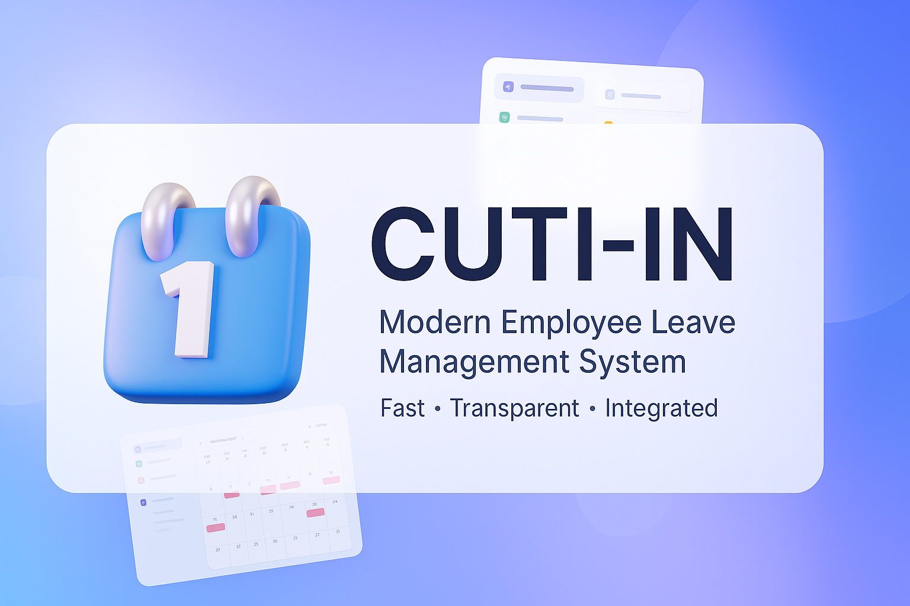

# FINAL-PROJECT-LAB-WEB25

<div align="center">
  
</div>

**Sistem Manajemen Cuti Karyawan Berbasis Web (CUTI-IN)**

Sistem manajemen cuti karyawan berbasis web yang menampilkan alur persetujuan bertingkat (tiered approval workflows), pelacakan kuota otomatis, dan kontrol akses multi-role. Sistem ini dirancang untuk membantu perusahaan dalam mengelola pengajuan cuti karyawan secara digital dengan efisien dan terstruktur.

## 📋 Daftar Isi

- [🎯 Fitur Utama](#-fitur-utama)
- [🛠️ Teknologi yang Digunakan](#️-teknologi-yang-digunakan)
- [👥 Role dan Hak Akses](#-role-dan-hak-akses)
- [🔄 Alur Persetujuan Cuti](#-alur-persetujuan-cuti)
- [📋 Prasyarat](#-prasyarat)
- [🚀 Instalasi](#-instalasi)
- [⚙️ Konfigurasi](#️-konfigurasi)
- [📖 Penggunaan](#-penggunaan)
- [📁 Struktur Proyek](#-struktur-proyek)
- [🏗️ Arsitektur & Design Patterns](#️-arsitektur--design-patterns)
- [🗄️ Struktur Database](#️-struktur-database)
- [🔧 Artisan Commands](#-artisan-commands)
- [🔄 Model Observers](#-model-observers)
- [🧪 Testing](#-testing)
- [🎨 Development](#-development)
- [🔍 Troubleshooting](#-troubleshooting)
- [📚 Referensi & Resources](#-referensi--resources)

---

## 🎯 Fitur Utama

### 1. **Manajemen Pengajuan Cuti**
- Pengajuan cuti tahunan (annual leave) dan cuti sakit (sick leave)
- Perhitungan hari cuti otomatis dengan mengecualikan hari libur nasional dan weekend
- Validasi tanggal (start date <= end date)
- Upload dokumen pendukung (attachment) - disimpan di storage
- Pelacakan status pengajuan secara real-time
- Unduh surat cuti dalam format PDF (generate dengan DomPDF)
- Batalkan pengajuan jika masih pending
- Detail view untuk setiap pengajuan (AJAX modal)
- Filter dan pagination untuk daftar pengajuan

### 2. **Alur Persetujuan Bertingkat**
- **Tingkat 1**: Persetujuan oleh Division Leader (Ketua Divisi)
- **Tingkat 2**: Persetujuan final oleh HRD
- Penolakan dengan catatan (minimal 10 karakter)
- Catatan persetujuan dari leader (`leader_note`)
- Catatan persetujuan dari HRD (`hrd_note`)
- Tracking user yang menyetujui (`approved_by`)
- Bulk approve/reject untuk efisiensi

### 3. **Manajemen Kuota Cuti**
- Tracking kuota cuti tahunan per karyawan (default: 12 hari)
- Pengurangan kuota otomatis saat cuti tahunan disetujui oleh HRD
- Validasi kuota sebelum pengajuan cuti tahunan
- Validasi kuota saat final approval oleh HRD
- Cuti sakit tidak mengurangi kuota cuti tahunan
- Command untuk reset kuota tahunan (`leave:reset-quota`)

### 4. **Manajemen Hari Libur**
- Manajemen hari libur nasional dan internal perusahaan
- Sinkronisasi otomatis hari libur dari Google Calendar Indonesia
- Parsing iCal format dari Google Calendar
- Filter dan sort untuk hari libur (national/manual, tanggal, judul)
- Bulk delete hari libur
- Penghitungan hari kerja otomatis (exclude weekends dan hari libur)
- API endpoint untuk mendapatkan daftar hari libur (AJAX)

### 5. **Manajemen Divisi**
- Manajemen divisi/departemen
- Penugasan division leader untuk setiap divisi
- Manajemen anggota divisi

### 6. **Dashboard Berdasarkan Role**
- Dashboard khusus untuk setiap role (Admin, HRD, Division Leader, User)
- Statistik dan ringkasan data relevan per role:
  - **Admin**: Total pengguna, divisi, hari libur, pengajuan cuti
  - **HRD**: Pengajuan menunggu approval, ringkasan cuti
  - **Leader**: Pengajuan dari anggota divisi yang pending
  - **User**: Statistik cuti sendiri, kuota tersisa, riwayat
- Notifikasi pengajuan yang menunggu persetujuan
- Quick access ke fitur utama per role

### 7. **Manajemen Pengguna**
- Manajemen data karyawan (CRUD)
- Penetapan role dan divisi
- Manajemen status aktif/nonaktif karyawan (otomatis atau manual)
- Manajemen kuota cuti per karyawan
- Upload avatar/foto profil
- Manajemen username, email, phone, address
- Manajemen tanggal bergabung (join_date)
- Validasi unique untuk email dan username

### 8. **Laporan dan Ringkasan**
- Ringkasan pengajuan cuti untuk Admin, HRD, dan Leader
- Filter berdasarkan divisi, periode, status, dan tipe cuti
- Statistik pengajuan cuti (total, approved, rejected, pending)
- Ringkasan kuota cuti per karyawan
- Export data (jika diperlukan)

### 9. **Manajemen Status Karyawan Otomatis**
- Update status aktif/nonaktif karyawan otomatis berdasarkan cuti yang disetujui
- Status otomatis inactive saat karyawan sedang dalam masa cuti
- Status otomatis active kembali setelah masa cuti selesai
- Command untuk sinkronisasi status karyawan (`leave:sync-employee-status`)

### 10. **Reset Kuota Cuti Otomatis**
- Command untuk reset kuota cuti tahunan (`leave:reset-quota`)
- Reset otomatis kuota menjadi 12 hari untuk karyawan eligible
- Validasi berdasarkan tanggal join karyawan

### 11. **Bulk Operations**
- Bulk approve/reject pengajuan cuti untuk Leader dan HRD
- Bulk delete hari libur untuk Admin

### 12. **Keamanan**
- Autentikasi berbasis Laravel Breeze
- Middleware role-based access control (CheckRole middleware)
- Verifikasi email (opsional)
- Reset password (dengan log file untuk development)
- Validasi form request terpusat

## 🛠️ Teknologi yang Digunakan

### Backend
- **PHP 8.2+**
- **Laravel Framework 12.0**
- **MySQL** 

### Frontend
- **Tailwind CSS 3.1.0** - Utility-first CSS framework
- **Alpine.js 3.4.2** - JavaScript framework untuk interaktivitas
- **Vite 7.0.7** - Build tool dan development server
- **Blade Templates** - Templating engine Laravel

### Libraries & Packages
- **Laravel Breeze 2.3** - Autentikasi scaffolding
- **Laravel DomPDF 3.1** - Generate PDF untuk surat cuti
- **Laravel Pint 1.24** - Code style fixer
- **PHPUnit 11.5.3** - Testing framework
- **Guzzle HTTP** - HTTP client untuk Google Calendar sync
- **Carbon** - Date manipulation library

### Development Tools
- **Laravel Sail 1.41** - Docker development environment
- **Laravel Pail 1.2.2** - Real-time log viewer
- **Concurrently 9.0.1** - Run multiple commands simultaneously

## 📁 Struktur Proyek

```
FINAL-PROJECT-LAB-WEB25/
├── manager_cuti/                 # Main application directory
│   ├── app/
│   │   ├── Console/              # Artisan commands
│   │   ├── Http/
│   │   │   ├── Controllers/      # Application controllers
│   │   │   │   ├── Admin/        # Admin controllers
│   │   │   │   ├── Hrd/          # HRD controllers
│   │   │   │   ├── Leader/       # Division Leader controllers
│   │   │   │   ├── User/         # User controllers
│   │   │   │   └── Auth/         # Authentication controllers
│   │   │   ├── Middleware/       # Custom middleware
│   │   │   ├── Requests/         # Form request validation
│   │   │   └── Rules/            # Custom validation rules
│   │   ├── Models/               # Eloquent models
│   │   ├── Observers/            # Model observers (LeaveRequestObserver)
│   │   ├── Providers/            # Service providers
│   │   ├── Services/             # Business logic services
│   │   └── View/                 # View components
│   ├── bootstrap/                # Bootstrap files
│   ├── config/                   # Configuration files
│   ├── database/
│   │   ├── migrations/           # Database migrations
│   │   ├── seeders/              # Database seeders
│   │   └── factories/            # Model factories
│   ├── app/
│   │   └── Console/
│   │       └── Commands/         # Custom Artisan commands
│   ├── public/                   # Public assets
│   ├── resources/
│   │   ├── css/                  # Stylesheets
│   │   ├── js/                   # JavaScript files
│   │   └── views/                # Blade templates
│   │       ├── admin/            # Admin views
│   │       ├── hrd/              # HRD views
│   │       ├── leader/           # Leader views
│   │       ├── user/             # User views
│   │       ├── auth/             # Authentication views
│   │       ├── leave-requests/   # Leave request views
│   │       └── layouts/          # Layout templates
│   ├── routes/
│   │   ├── web.php               # Web routes
│   │   └── auth.php              # Authentication routes
│   ├── storage/                  # Storage files
│   ├── tests/                    # Automated tests
│   ├── vendor/                   # Composer dependencies
│   ├── artisan                   # Artisan CLI
│   ├── composer.json             # PHP dependencies
│   └── package.json              # Node.js dependencies
└── README.md                     # Dokumentasi proyek
```

## 👥 Role dan Hak Akses

Sistem ini mendukung 4 role utama dengan hak akses yang berbeda:

### 1. **Admin**
Hak akses penuh untuk mengelola sistem:
- ✅ Manajemen divisi (CRUD)
- ✅ Manajemen pengguna/karyawan (CRUD)
- ✅ Manajemen hari libur (CRUD)
- ✅ Melihat semua pengajuan cuti
- ✅ Melihat ringkasan cuti (leave summary)
- ✅ Sinkronisasi hari libur dari Google Calendar

### 2. **HRD**
Mengelola pengajuan cuti dan persetujuan final:
- ✅ Persetujuan final pengajuan cuti (setelah disetujui leader)
- ✅ Penolakan pengajuan cuti
- ✅ Melihat pengajuan yang sudah disetujui leader
- ✅ Melihat pengajuan dari division leader (langsung ke HRD)
- ✅ Melihat ringkasan cuti
- ✅ Bulk update pengajuan cuti

### 3. **Division Leader**
Mengelola pengajuan cuti dari anggota divisinya:
- ✅ Melihat pengajuan cuti dari anggota divisi (status: pending)
- ✅ Menyetujui pengajuan cuti (tingkat 1)
- ✅ Menolak pengajuan cuti
- ✅ Menambahkan catatan persetujuan
- ✅ Bulk update pengajuan cuti
- ✅ Mengajukan cuti sendiri (langsung ke HRD)

### 4. **User (Karyawan)**
Fitur dasar untuk karyawan:
- ✅ Mengajukan cuti (tahunan/sakit)
- ✅ Melihat riwayat pengajuan cuti sendiri
- ✅ Membatalkan pengajuan (jika masih pending)
- ✅ Mengunduh surat cuti (PDF) jika disetujui
- ✅ Melihat statistik cuti sendiri
- ✅ Mengelola profil

## 🔄 Alur Persetujuan Cuti

### Untuk Karyawan Biasa (User)

```
1. Karyawan mengajukan cuti
   ↓
2. Status: "pending"
   ↓
3. Division Leader meninjau dan memutuskan:
   ├─ Menyetujui → Status: "approved_by_leader"
   │                ↓
   │  4. HRD meninjau dan memutuskan:
   │     ├─ Menyetujui → Status: "approved"
   │     │              ├─ Kuota dikurangi (jika annual leave)
   │     │              └─ Karyawan bisa download PDF
   │     │
   │     └─ Menolak → Status: "rejected"
   │                  └─ Catatan penolakan tersimpan
   │
   └─ Menolak → Status: "rejected"
                └─ Catatan penolakan tersimpan
```

### Untuk Division Leader

```
1. Division Leader mengajukan cuti
   ↓
2. Status: "pending" (langsung ke HRD, skip leader approval)
   ↓
3. HRD meninjau dan memutuskan:
   ├─ Menyetujui → Status: "approved"
   │              ├─ Kuota dikurangi (jika annual leave)
   │              └─ Bisa download PDF
   │
   └─ Menolak → Status: "rejected"
                └─ Catatan penolakan tersimpan
```

### Status Pengajuan Cuti

- **pending**: Menunggu persetujuan
- **approved_by_leader**: Disetujui oleh division leader, menunggu persetujuan HRD
- **approved**: Disetujui sepenuhnya dan siap digunakan
- **rejected**: Ditolak oleh division leader atau HRD

## 📋 Prasyarat

Sebelum memulai instalasi, pastikan sistem Anda memiliki:

- **PHP** >= 8.2 
- **Composer** >= 2.0
- **Node.js** >= 18.0 dan **NPM** >= 8.0
- **Git**

## 🚀 Instalasi

### 1. Clone Repository

```bash
git clone <repository-url>
cd FINAL-PROJECT-LAB-WEB25
cd manager_cuti
```

### 2. Install Dependencies PHP

```bash
composer install
```

### 3. Install Dependencies Node.js

```bash
npm install
```

### 4. Setup Environment

```bash
# Copy file environment
cp .env.example .env

# Generate application key
php artisan key:generate
```

### 5. Konfigurasi Database

Edit file `.env` dan sesuaikan konfigurasi database:

```env
DB_CONNECTION=mysql
DB_HOST=127.0.0.1
DB_PORT=3306
DB_DATABASE=nama_database
DB_USERNAME=username
DB_PASSWORD=password
```


### 6. Run Migration dan Seeder

```bash
php artisan migrate
php artisan db:seed --class=RoleSeeder
```

### 7. Build Assets

Untuk development:
```bash
npm run dev
```

Untuk production:
```bash
npm run build
```

### 8. Jalankan Server Development

```bash
php artisan serve
```

Aplikasi akan berjalan di `http://localhost:8000`

### Quick Setup (Menggunakan Composer Script)

```bash
composer run setup
```

Script ini akan menjalankan semua langkah instalasi secara otomatis.

## ⚙️ Konfigurasi

### Akun Default

Setelah menjalankan seeder, akun default berikut tersedia:

**Admin:**
- Email: `admin@example.com`
- Password: `Password`

**HRD:**
- Email: `hrd@example.com`
- Password: `Password`

**Division Leader (IT):**
- Email: `lead.it@example.com`
- Password: `Password`

**Staff (IT):**
- Email: `staff.it@example.com`
- Password: `Password`

**Staff (Finance):**
- Email: `staff.finance@example.com`
- Password: `Password`

⚠️ **PENTING**: Ubah password default setelah instalasi pertama!

### Konfigurasi Google Calendar Sync

Untuk menggunakan fitur sync hari libur dari Google Calendar:

1. Buka Google Calendar Indonesia: https://calendar.google.com/calendar/ical/id.indonesian%23holiday%40group.v.calendar.google.com/public/basic.ics
2. URL ini sudah dikonfigurasi di `HolidayController` untuk sync otomatis
3. Klik tombol "Sync Google Calendar" di halaman Admin → Holidays

**Catatan**: Sync akan mengambil hari libur nasional untuk tahun berjalan dan tahun depan.

## 📖 Penggunaan

### 🔐 Reset Password

Untuk melakukan reset password di development environment:

1. Akses halaman forgot password: `http://localhost:8000/forgot-password`
2. Masukkan email yang terdaftar
3. Reset link akan tersimpan di log file (karena menggunakan mail driver `log`)
4. Buka file `storage/logs/laravel.log` dan cari URL reset link
5. Copy URL dan buka di browser untuk reset password

Untuk panduan lengkap, lihat: `manager_cuti/HOW_TO_FORGET_PASSWORD.md`

### Untuk Karyawan (User)

1. **Login** dengan akun karyawan
2. **Dashboard** menampilkan statistik cuti Anda
3. **Ajukan Cuti**:
   - Pilih tipe cuti (Tahunan/Sakit)
   - Isi tanggal mulai dan akhir
   - Sistem akan menghitung hari cuti otomatis (exclude weekends dan hari libur)
   - Isi alasan cuti, alamat saat cuti, dan kontak darurat
   - Upload dokumen pendukung (opsional)
   - Submit pengajuan
4. **Lacak Status** pengajuan di halaman "Pengajuan Cuti"
5. **Unduh PDF** surat cuti setelah disetujui

### Untuk Division Leader

1. **Login** dengan akun division leader
2. **Dashboard** menampilkan pengajuan yang menunggu persetujuan
3. **Review Pengajuan**:
   - Buka halaman "Pengajuan Cuti Divisi"
   - Tinjau detail pengajuan
   - Approve atau Reject
   - Tambahkan catatan (opsional)
4. **Bulk Update** untuk menangani multiple pengajuan sekaligus

### Untuk HRD

1. **Login** dengan akun HRD
2. **Dashboard** menampilkan ringkasan pengajuan
3. **Review Pengajuan**:
   - Buka halaman "Pengajuan Cuti"
   - Tinjau pengajuan yang sudah disetujui leader
   - Approve final atau Reject
4. **Lihat Ringkasan** cuti semua karyawan
5. **Filter** berdasarkan divisi, periode, dan status

### Untuk Admin

1. **Login** dengan akun admin
2. **Manajemen Divisi**:
   - Tambah/edit/hapus divisi
   - Tetapkan division leader
   - Kelola anggota divisi
3. **Manajemen Karyawan**:
   - Tambah/edit/hapus karyawan
   - Set role dan divisi
   - Kelola kuota cuti
4. **Manajemen Hari Libur**:
   - Tambah hari libur manual
   - Sinkronisasi dari Google Calendar (opsional)
5. **Lihat Semua Pengajuan** dan ringkasan

## 🏗️ Arsitektur & Design Patterns

### Service Layer
Sistem menggunakan **Service Layer Pattern** untuk memisahkan business logic dari controller:

- **LeaveRequestService**: Menangani semua operasi terkait pengajuan cuti
  - `createLeaveRequest()`: Membuat pengajuan cuti baru dengan validasi kuota
  - `approveByLeader()`: Persetujuan oleh division leader (validasi authorization)
  - `finalApprove()`: Persetujuan final oleh HRD dengan pengurangan kuota otomatis
  - `reject()`: Penolakan pengajuan dengan validasi minimal 10 karakter
  - `cancel()`: Pembatalan oleh user (hanya untuk pending status)
  - `delete()`: Hapus pengajuan (termasuk attachment cleanup)

**Keuntungan Service Layer:**
- Business logic terpusat dan reusable
- Mudah di-test
- Controller lebih clean dan fokus pada HTTP handling

### Model Observers
- **LeaveRequestObserver**: Otomatis update status karyawan berdasarkan cuti

### Middleware
- **CheckRole**: Middleware untuk role-based access control

### Validation
- Custom validation rules (`DivisionLeaderRule`)
- Form Request Validation (`ProfileUpdateRequest`, `LoginRequest`)

## 🗄️ Struktur Database

Sistem menggunakan 4 tabel utama:

### 1. **users**
Menyimpan data pengguna/karyawan:
- Informasi personal (username, nama, email, phone, address)
- Role (admin, hrd, division_leader, user)
- Division ID (relasi ke divisions)
- Join date (tanggal bergabung)
- Leave quota (kuota cuti tahunan, default: 12)
- Active status (boolean, otomatis update berdasarkan cuti)
- Avatar (path ke file avatar)
- Email verification timestamp

### 2. **divisions**
Menyimpan data divisi/departemen:
- Nama divisi
- Deskripsi
- Leader ID (relasi ke users)

### 3. **leave_requests**
Menyimpan pengajuan cuti:
- User ID (pemohon)
- Leave type (annual/sick)
- Start date, end date, total days
- Reason, address during leave, emergency contact
- Attachment path
- Status (pending/approved_by_leader/approved/rejected)
- Approved by (user ID yang menyetujui)
- Leader note, rejection note

### 4. **holidays**
Menyimpan hari libur:
- Title (nama hari libur)
- Holiday date (unique, untuk menghindari duplikasi)
- Description
- Is national holiday (boolean, true jika dari Google Calendar)

### Relasi Database

```
users (1) ──→ (N) divisions (leader_id)
users (1) ──→ (N) leave_requests (user_id)
users (1) ──→ (N) leave_requests (approved_by)
divisions (1) ──→ (N) users (division_id)
```

### Constraints & Indexes

- **users.email**: UNIQUE
- **users.username**: UNIQUE
- **holidays.holiday_date**: UNIQUE
- Foreign keys dengan `ON DELETE CASCADE` atau `ON DELETE SET NULL`
- Index pada kolom yang sering digunakan untuk query

### ERD Diagram

File ERD tersedia di `manager_cuti/ERD_CUTI_IN.dbml`. Anda dapat melihat diagram visual dengan:
1. Buka https://dbdiagram.io
2. Copy paste isi file ERD_CUTI_IN.dbml
3. Diagram akan otomatis ter-render

## 🔧 Artisan Commands

### Custom Commands

#### 1. Reset Annual Leave Quota
Reset kuota cuti tahunan menjadi 12 hari untuk semua karyawan yang eligible:

```bash
# Reset kuota (aktual)
php artisan leave:reset-quota

# Dry run (simulasi tanpa perubahan)
php artisan leave:reset-quota --dry-run
```

**Cara kerja:**
- Reset kuota menjadi 12 hari untuk karyawan yang join date <= 1 Januari tahun lalu
- Ideal untuk dijalankan setiap 1 Januari (via scheduler)

#### 2. Sync Employee Status
Sinkronisasi status aktif/nonaktif karyawan berdasarkan cuti yang disetujui:

```bash
# Sync status (aktual)
php artisan leave:sync-employee-status

# Dry run (simulasi tanpa perubahan)
php artisan leave:sync-employee-status --dry-run
```

**Cara kerja:**
- Set status inactive untuk karyawan yang sedang dalam masa cuti (approved/approved_by_leader)
- Set status active kembali untuk karyawan yang sudah selesai cuti

### Standard Laravel Commands

```bash
# Clear cache
php artisan cache:clear
php artisan config:clear
php artisan view:clear
php artisan route:clear

# Run migrations
php artisan migrate
php artisan migrate:fresh --seed

# Generate model dengan migration
php artisan make:model ModelName -m

# Generate controller
php artisan make:controller ControllerName

# List semua routes
php artisan route:list

# Queue worker
php artisan queue:work
php artisan queue:listen

# Tinker (interactive shell)
php artisan tinker
```

## 🔄 Model Observers

Sistem menggunakan **LeaveRequestObserver** untuk otomatis mengupdate status karyawan:

### LeaveRequestObserver

Observer ini akan:
- **On Created**: 
  - Jika cuti dibuat dengan status approved/approved_by_leader dan tanggal sudah dimulai → set karyawan menjadi inactive
  - Skip untuk role admin
  
- **On Updated**: 
  - Jika cuti disetujui dan tanggal sudah dimulai → set inactive
  - Jika cuti berakhir atau ditolak → cek apakah ada cuti aktif lain, jika tidak set active kembali
  - Skip untuk role admin

**Catatan**: Observer hanya berjalan untuk karyawan dengan role selain admin.

## 🧪 Testing

### Menjalankan Tests

```bash
# Jalankan semua tests
php artisan test

# Jalankan dengan coverage
php artisan test --coverage

# Jalankan specific test file
php artisan test tests/Feature/Auth/LoginTest.php
```

### Struktur Tests

```
tests/
├── Feature/              # Integration/Feature tests
│   ├── Auth/            # Authentication tests
│   └── Profile/         # Profile tests
└── Unit/                # Unit tests
```

### Test Coverage

Sistem ini dilengkapi dengan test cases untuk:
- Autentikasi (login, register, password reset)
- Profile management
- Leave request creation
- Role-based access control

## 🎨 Development

### Menjalankan Development Server

Gunakan composer script untuk menjalankan semua service sekaligus:

```bash
composer run dev
```

Ini akan menjalankan:
- Laravel development server
- Queue worker
- Log viewer (Pail)
- Vite dev server

### Code Style

Gunakan Laravel Pint untuk format code:

```bash
# Format semua file
./vendor/bin/pint

# Format specific file
./vendor/bin/pint app/Models/User.php

# Test format (dry run)
./vendor/bin/pint --test
```

### Schedule Tasks (Cron Jobs)

Untuk production, tambahkan ke crontab:

```bash
* * * * * cd /path-to-project/manager_cuti && php artisan schedule:run >> /dev/null 2>&1
```

Atau konfigurasi di `app/Console/Kernel.php` untuk:
- Reset kuota cuti setiap 1 Januari
- Sync status karyawan setiap hari

### Environment Variables

Pastikan file `.env` sudah dikonfigurasi dengan benar:

```env
APP_NAME=CUTI-IN
APP_ENV=local
APP_KEY=base64:...
APP_DEBUG=true
APP_URL=http://localhost:8000

DB_CONNECTION=mysql
DB_HOST=127.0.0.1
DB_PORT=3306
DB_DATABASE=nama_database
DB_USERNAME=username
DB_PASSWORD=password

MAIL_MAILER=log
MAIL_HOST=mailpit
MAIL_PORT=1025
MAIL_USERNAME=null
MAIL_PASSWORD=null
MAIL_ENCRYPTION=null
MAIL_FROM_ADDRESS="hello@example.com"
MAIL_FROM_NAME="${APP_NAME}"
```
## 🔍 Troubleshooting

### Masalah Umum

#### 1. Error saat migrate
```bash
# Pastikan database sudah dibuat
# Cek konfigurasi di .env
php artisan config:clear
php artisan migrate:fresh --seed
```

#### 2. Asset tidak ter-load
```bash
npm install
npm run build
# atau untuk development
npm run dev
```

#### 3. Permission denied pada storage
```bash
# Linux/Mac
chmod -R 775 storage bootstrap/cache
chown -R www-data:www-data storage bootstrap/cache

# Windows
# Pastikan folder storage dan bootstrap/cache memiliki permission write
```

#### 4. PDF tidak bisa di-generate
- Pastikan extension GD atau Imagick sudah terinstall di PHP
- Cek file `public/check-gd.php` untuk verifikasi

#### 5. Email tidak terkirim (development)
- Sistem menggunakan mail driver `log` untuk development
- Cek email di `storage/logs/laravel.log`
- Untuk production, ubah `MAIL_MAILER` di `.env`

### Log & Debugging

```bash
# Lihat log real-time
php artisan pail

# Lihat log file
tail -f storage/logs/laravel.log

# Clear semua cache
php artisan optimize:clear
```

## 📚 Referensi & Resources

### Dokumentasi
- [Laravel Documentation](https://laravel.com/docs)
- [Laravel Breeze](https://laravel.com/docs/breeze)
- [Tailwind CSS](https://tailwindcss.com/docs)
- [Alpine.js](https://alpinejs.dev/)
- [DomPDF](https://github.com/barryvdh/laravel-dompdf)

### Internal Documentation
- `HOW_TO_FORGET_PASSWORD.md` - Panduan reset password
- `ERD_CUTI_IN.dbml` - Database ERD diagram

## 👤 Author

**Dalvyn Suhada - Final Project Lab Web 25**

## 🙏 Acknowledgments

- Laravel Framework
- Laravel Breeze
- Tailwind CSS
- Alpine.js
- DomPDF
- Semua kontributor open source yang digunakan dalam proyek ini

---

**Selamat menggunakan CUTI-IN! 🎉**

Jika ada pertanyaan atau masalah, silakan buat issue di repository ini.
